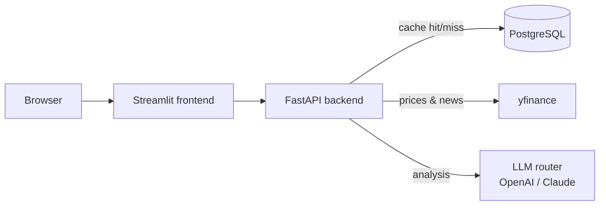

# AI Stock Research Dashboard

A full-stack financial research tool. Enter a ticker and it pulls live market data,
compares the stock's one-month return against its sector ETF, and generates an
analyst-style write-up using a large language model. Built as a portfolio project to
practise end-to-end engineering: a typed API, a caching layer, containers, tests, CI,
and infrastructure-as-code for both Kubernetes and AWS.

[](https://github.com/ofir9801/stock-ai-project/actions/workflows/ci.yml)


> Educational project only — the analysis is not financial advice.

## How it works



1. The backend checks PostgreSQL for a recent (≤1h) cached result for the ticker.
2. On a miss, it fetches prices, history and news from `yfinance`, computes the
   stock's return versus its sector ETF, and sends the data to an LLM.
3. The result is cached and returned. The frontend renders the price chart, the
   sector comparison ("alpha"), the news, and the AI write-up.

If no AI key is configured the backend returns a deterministic mock, so the app runs
end-to-end out of the box.

## Tech stack

| Area | Choice | Notes |
|------|--------|-------|
| Backend | FastAPI + Uvicorn | `GET /api/stock/{ticker}` |
| Frontend | Streamlit | Charts, metrics, news, analysis |
| Market data | yfinance + pandas | Prices, history, sector ETF, news |
| AI | OpenAI + Anthropic (Claude) | Provider router with mock fallback |
| Cache | PostgreSQL + SQLAlchemy | Per-ticker, TTL-based |
| Containers | Docker + Docker Compose | One command for the whole stack |
| Tests / CI | pytest + ruff + GitHub Actions | Lint and tests on every push/PR |
| Orchestration | Kubernetes (kind) | Manifests under `k8s/` |
| Cloud | AWS via Terraform | ECR, ECS Fargate, RDS, Secrets Manager, ALB |

### Multi-model AI routing

`AI_PROVIDER` selects the provider: `auto` (prefer Claude, fall back to OpenAI, then a
mock), or force `claude` / `openai`. Each provider is a small adapter behind a shared
prompt builder, so adding another is a single function. Failures are logged in full
server-side and surfaced to the client as a generic message.

## Run it locally

### With Docker Compose (recommended)

```bash
cp .env.example .env        # optional: add OPENAI_API_KEY / ANTHROPIC_API_KEY
docker compose up --build
```

- Dashboard: http://localhost:8501
- API: http://localhost:8000  (docs at `/docs`)

Compose runs PostgreSQL, the backend and the frontend, wired together with
health-check gating so the backend only starts once the database is ready.

### Without Docker

```bash
python -m venv venv
venv\Scripts\activate                 # Windows  (use source venv/bin/activate on macOS/Linux)
pip install -r requirements.txt

uvicorn app.main:app --reload         # terminal 1 — backend
streamlit run dashboard.py            # terminal 2 — frontend
```

Without a running PostgreSQL the app still works — caching simply turns itself off.

## Configuration

All configuration is via environment variables (see `.env.example`):

| Variable | Default | Purpose |
|----------|---------|---------|
| `AI_PROVIDER` | `auto` | `auto` / `claude` / `openai` |
| `OPENAI_API_KEY` | – | Enables the OpenAI provider |
| `ANTHROPIC_API_KEY` | – | Enables the Claude provider |
| `CLAUDE_MODEL` | `claude-opus-4-8` | Override the Claude model |
| `OPENAI_MODEL` | `gpt-4o-mini` | Override the OpenAI model |
| `DATABASE_URL` | local Postgres | SQLAlchemy connection string |
| `CACHE_TTL_SECONDS` | `3600` | How long a cached analysis stays fresh |
| `BACKEND_URL` | `http://127.0.0.1:8000` | Where the frontend calls the API |
| `FRONTEND_ORIGIN` | `http://localhost:8501` | Allowed CORS origin |

## Tests

```bash
pip install -r requirements-dev.txt
ruff check .
pytest -v
```

The suite mocks `yfinance`, the LLM and the database, so it needs no network or
credentials. GitHub Actions runs the same lint and tests on every push and PR.

## Deployment

- **Kubernetes (local, via kind):** manifests and step-by-step instructions in
  [`k8s/README.md`](k8s/README.md) — Deployments, Services, ConfigMaps, Secrets, a
  PVC for Postgres, health probes and an HPA.
- **AWS (Terraform):** ECR, ECS Fargate (two services with Cloud Map service
  discovery), RDS PostgreSQL, Secrets Manager and an ALB — see
  [`terraform/README.md`](terraform/README.md).

## Project structure

```
.
├── app/
│   ├── main.py                 # FastAPI app and routes
│   ├── db.py                   # SQLAlchemy engine + cache model
│   └── services/
│       ├── finance_service.py  # yfinance data + sector-ETF comparison
│       ├── ai_service.py       # multi-model LLM router
│       └── cache_service.py    # PostgreSQL read/write with TTL
├── dashboard.py                # Streamlit frontend
├── tests/                      # pytest suite
├── Dockerfile.backend
├── Dockerfile.frontend
├── docker-compose.yml
├── k8s/                        # Kubernetes manifests (kind)
├── terraform/                  # AWS infrastructure-as-code
└── .github/workflows/ci.yml    # lint + tests
```

## Design notes

A few deliberate trade-offs, called out so they don't read as oversights:

- **Schema management.** The single cache table is created on boot via SQLAlchemy's
  `create_all`. That's fine for one table but can't evolve columns safely — a
  production project would use Alembic migrations. Left out to keep scope tight.
- **Database placement on AWS.** RDS sits in the (cost-saving, NAT-free) public
  subnets but is *not* publicly accessible — only the ECS security group can reach it.
  Private subnets would be stricter, at the cost of a NAT gateway.
- **Sync endpoints.** The API uses sync handlers, which FastAPI runs in a threadpool.
  Simple and fine at this scale; LLM/`yfinance` calls carry explicit timeouts so a slow
  upstream can't pin a worker indefinitely. A high-throughput version would go async.

## License

MIT © [Ofir Eren](https://github.com/ofir9801)
